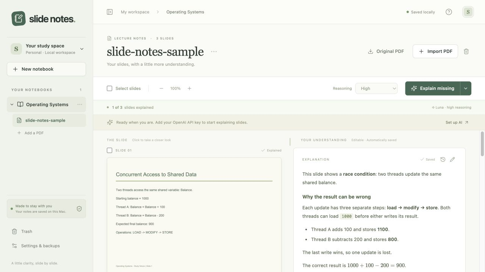

# Slide Explain

A local notebook that puts lecture slides on the left and editable AI explanations on the right. Import a PDF, preview it, then explain all, selected, or missing slides with GPT-6 Luna. Your original PDFs, personal notes, and explanation history remain on your Mac.

## Start

Requirements: **macOS**, **Node 22.21.1** (or a newer Node 22), and **uv**. uv installs the pinned Python 3.12 runtime and Python dependencies. If you use nvm, run `nvm install 22.21.1` once. Install uv using [its official instructions](https://docs.astral.sh/uv/getting-started/installation/).

```sh
git clone https://github.com/shnrndk/slide-explain.git
cd slide-explain
cp .env.example .env
# Edit .env and set OPENAI_API_KEY to your OpenAI API key.
./start.command
```

Open **http://127.0.0.1:8000**. You can also double-click `start.command` in Finder. Keep its terminal open; press Control+C to stop. The first launch downloads dependencies. The app still works for importing, reading, and editing notes without an API key or internet after setup. The launch script installs/builds only when dependencies or sources change.

API requests are billed to your OpenAI API account. The default model is `gpt-6-luna` with high reasoning; medium and extra high are available. Your key is read only by the backend. The interface shows whether a key exists, never its value. Model access is checked by OpenAI when generating; errors appear beside the affected slide. There is no automatic model fallback.

## Study workflow

1. Create a notebook for a subject.
2. Import a PDF (up to 100 MB / 500 pages). Export PowerPoint or Keynote to PDF first. Password-protected PDFs must be unlocked before import.
3. Select slides and choose **Explain selected**, or use **Explain missing** / **Explain all slides**. Importing alone does not incur API usage.
4. Click a slide to enlarge it. Drag the divider above the columns to resize; the divider also supports arrow keys. The zoom buttons resize explanation text; slide images can be enlarged separately.
5. Edit explanations with the pencil button. Markdown, fenced code, and `$inline$` / `$$display$$` math are supported. Add your own thoughts under **My notes**.
6. Edits save after a short pause and on blur. Wait for **Saved** before shutting down. If the server is offline, pending drafts remain in browser storage. Conflicts preserve your draft and ask which version to keep.
7. History keeps saved edits and every completed generation. If an explanation is edited while AI is generating, the new AI result goes into history without replacing your edit. Deleting a notebook or document moves it to recoverable trash.

**Reading mode:** Click **Reading mode** beside the document actions to hide navigation, toolbars, selection, and editing controls. Slides and explanations expand into the available space with larger text. Existing personal notes remain readable. Click **Exit reading mode** or press **Escape** to return to editing at the same slide; your drafts, selection, zoom, and sidebar preference are preserved.

Queue pause lets in-flight requests finish but does not start new ones. Cancellation discards queued and in-flight results; an already-submitted OpenAI request may still incur charges. Closing the browser does not stop generation while the backend runs. On restart, interrupted requests require an explicit retry; untouched queued work resumes unless paused. Network/rate-limit/server errors receive up to two bounded retries. A lost response can result in a repeated paid request.

## Storage and backups

New installations use the directory below. An existing **Slide Notes** installation keeps its original data directory automatically, including private configuration and saved notebooks. `SLIDE_NOTES_DATA_DIR` remains supported for compatibility.

Default directory:

```text
~/Library/Application Support/Slide Explain/
  notes.sqlite3       # notebooks, notes, revisions, durable jobs, settings
  assets/<id>/        # original.pdf and rendered page PNGs
  backups/            # complete portable ZIP archives
```

Set `SLIDE_EXPLAIN_DATA_DIR` in `.env` to override the directory. Keep the live database on a local disk. Do not use browser local storage as the main database or place the live SQLite files in a cloud-sync folder.

- SQLite uses transactions, foreign keys, WAL, and FULL synchronous durability. Schema version 4 is recorded in both migration records and `user_version`; newer schema versions are refused.
- PDF imports are staged and published together. Partial imports are cleaned up on failure/startup. Unreferenced assets left by a process kill between publication and commit are ignored by backups.
- Daily backups run while the app is open. Retention keeps the latest copy for each of seven recent backup days and four recent backup weeks. Up to five restore safety snapshots are retained independently.
- **Settings & backups → Back up now** creates an archive you can download. Archives include PDFs, slide images, notes, jobs, and version history, but not `.env` or API credentials.
- Configure an existing second backup folder (iCloud Drive or an external disk) for another copy. Save settings before backing up. A disconnected folder is reported, and the local backup remains available.
- Restore checks archive paths, checksums, SQLite integrity, foreign keys, schema compatibility, and referenced assets. Pause generation and let running jobs finish first. Restore creates a safety backup, pauses writes under a maintenance lock, and uses a recovery journal for interrupted file swaps. Generation stays paused afterward.
- Same-disk backups help recover edits, but cannot protect against losing the Mac or its disk. Keep the second copy on another device or in cloud storage.
- A restored library gets a new epoch, so tabs open before restore cannot overwrite it with old revisions. Browser drafts from the old epoch remain in browser storage for recovery; they are not automatically applied to restored notes.

Only run **one backend process per data directory**. The app enforces an exclusive process lock. Use the provided launcher; do not run Uvicorn with multiple workers.

## Development and verification

```sh
uv sync --frozen
uv run pytest -q
cd frontend
npm ci
npm test
npm run build
```

For frontend development, run the backend on port 8000, then `npm run dev` inside `frontend`. Vite proxies `/api` to the backend. The normal launch serves the built interface and API from the same localhost origin. Requests from foreign browser origins are rejected. No telemetry, remote fonts, or hosted assets are needed for reading notes.

Automated tests use generated PDF fixtures and mocked OpenAI responses. They cover portrait/landscape/scanned PDFs, failed imports, note conflicts, edit history, two-worker concurrency, interrupted/cancelled jobs, preservation of edits during generation, backups, restore, and draft persistence. To run a small paid smoke test after configuring a key:

```sh
uv run python scripts/smoke_ai.py
```

The smoke test generates one explanation using a temporary library and reports success and token counts without printing credentials. It does not change your notebooks.

## Layout

- `backend/`: FastAPI, SQLite, PDF import, OpenAI queue, backup/recovery.
- `frontend/src/`: React study interface, note editor, settings, tests.
- `tests/`: backend integration tests and PDF fixtures.
- `scripts/start.sh`: single-command setup and launch.

Version one is single-user and local. PDF imports only; cloud sync, handwriting, and annotations on the original slide images are not included.

## Interface preview

The screenshot below uses a generated test PDF and a manually entered example explanation; it is not a live-model result.



## Mac desktop app

Open **`dist/Slide Explain.app`**, or drag it into Applications. The built app includes Python, the PDF renderer, and the interface; build it using the command below. The built app needs no terminal, Node, or Python installation to run. The current build targets Apple Silicon Macs.

The desktop and browser versions share `~/Library/Application Support/Slide Explain`, including your existing notebooks and backups. If the browser backend is already running on port 8000, the desktop app uses it and leaves it running when you quit. Otherwise, the desktop app starts its own backend and stops it on quit. Completed explanations remain saved, and interrupted requests are available to retry. The app warns before quitting with generation or unsaved edits in progress. Native browser drafts persist between launches.

Choose **Notebook → Configure API key…** in the Mac menu bar to save your key, then restart the app (and the browser backend, if running). The key is saved with owner-only permissions in `config.env` in the application data directory. It is excluded from the app bundle and notebook backups. This configuration is also read by the browser backend; an explicitly set environment variable takes precedence, followed by `config.env`, then the project's `.env`.

Reading mode, PDF import, backup downloads, editing, history, and restore use the same interface as the browser app. Native View and Edit menus provide fullscreen and copy/paste. Your browser's current document selection and unsaved drafts are separate from the desktop window; saved notes are shared.

Rebuild from source with the pinned development runtimes:

```sh
./scripts/build-desktop.sh
```

Build output is local and ad-hoc signed, not an Apple-notarized distribution. To verify the packaged backend in an isolated library:

```sh
SLIDE_NOTES_DATA_DIR="$(mktemp -d)" 'dist/Slide Explain.app/Contents/MacOS/Slide Explain' --check
```

## Detailed explanations, appearance, and portable backups

- Use **Explain in detail** beside a slide’s explanation to generate a separate, deeper explanation. The compact view can be closed while generation runs; reopen it from the same button. Detailed notes support editing, autosave, version history, and restoring older versions, independently of the main explanation and personal notes.
- Use the **moon/sun button** in the header (also available in reading mode) to switch themes. Your choice persists on that browser or desktop window. Original slide images retain their original colors.
- Backup ZIPs contain original PDFs, rendered slide images, all notes and histories in SQLite, and readable Markdown exports under `exports/<document-id>/notes.md`. `README.txt` describes the contents. Detailed explanations are included. Existing version-one backups remain restorable.
- The window is fixed to the viewport; only the study pane, notebook list, and dialogs scroll, preventing trackpad scrolling from moving the entire app into blank space.

Detailed explanations take the next available generation slot before waiting bulk-slide jobs. Already-running requests finish normally, and the two-request concurrency limit still applies. The detail view distinguishes waiting from an active API request; high-reasoning requests can still take several minutes after they start.

## Highlighting and underlining

Select text in a saved explanation (including its detailed view and reading mode) to open the formatting palette. Choose yellow, green, blue, or pink, or underline the selection. You can combine a highlight with an underline. Select marked text and use the eraser to remove markings that touch that selection.

Markings are saved separately in SQLite, synchronized between open windows, and included in backups and readable note exports. They do not change the Markdown text or overwrite notes. Markings belong to the exact explanation content: after editing or regenerating the explanation, its older markings are kept with that content and reappear if you restore it from history. A marking is never reapplied if its selected words no longer match. Save text edits before highlighting.

### Slide chat and personal notes

Click the small speech bubble beside an explanation to ask about that slide. Conversations are saved locally, included in backups, and remain available in reading mode. Questions use the selected reasoning setting and share the two-request generation limit. Select answer text and choose **Add to my notes** to append it without replacing existing notes. Save any pending note draft first.

Personal notes open as readable text: select passages to highlight or underline them. Choose **Edit**, then **Save** to return to reading. Background autosave and revision conflict protection remain active while editing.
